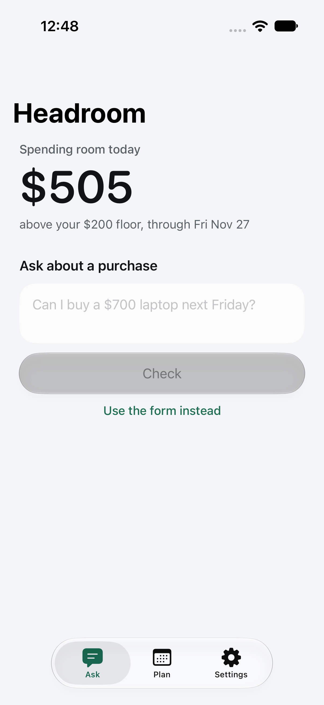
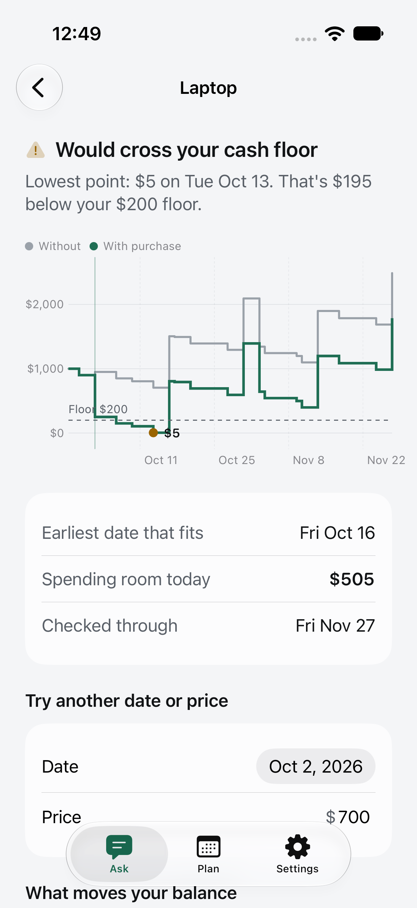
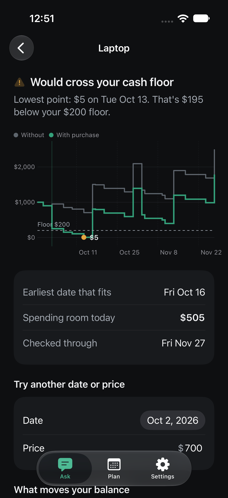

# Headroom

[](https://github.com/saihitesh-14/headroom/actions/workflows/ci.yml)

**See what a purchase does to your checking balance before your next bills. Private, on your iPhone, no bank login.**

<p>
  
  
  
</p>

## How it works

You enter a checking balance, a cash floor (the lowest balance you want to keep), your paychecks, and your bills. Then you ask a question like *"Can I buy a $700 laptop next Friday?"*

```
question ──► reader ──► you confirm item, price, date ──► engine ──► result
             (built-in parser,                            (pure Swift,
              or Apple's on-device model)                  day by day)
```

The engine walks your balance forward one day at a time, with and without the purchase, and reports:

- **Fits your cash floor**, **Would cross your cash floor**, **Known bills exceed projected cash**, or **Needs more information**
- the lowest point and the day it happens
- spending room today, and the earliest date the purchase fits
- the paychecks and bills that drive the result

The AI never does math. Prices come only from the digits you typed, and every number on screen comes from the engine.

## Privacy

- No accounts, no bank connection, no analytics, no network code. CI fails the build if networking code appears.
- Your plan is one JSON file protected with iOS complete file protection (unreadable while the phone is locked).
- Optional Face ID or passcode lock, and the app hides its content in the app switcher.
- Your plan is included in your normal encrypted iPhone backups, so a lost phone does not lose it.
- Delete everything from Settings at any time.

## The math

Written so the rules are easy to check:

1. The balance must be confirmed today. A stale balance gets a question, not an answer.
2. For items dated today, bills are subtracted and pay is not added unless you mark them when you confirm your balance.
3. On any day, money out is counted before money in, so a purchase on payday is checked before the pay lands.
4. Every purchase date is checked through the same end date (61 days out), so next month's rent is always included.
5. Money is stored as whole cents. Dates are calendar days with no time zone.

The engine lives in [`Packages/HeadroomCore`](Packages/HeadroomCore) and has its own test suite, including the worked example from the [original plan](docs/original-plan.md).

## Run it

Requires Xcode 26 or later and iOS 26 or later.

```bash
git clone https://github.com/saihitesh-14/headroom.git
cd headroom
open Headroom.xcodeproj
```

Pick an iPhone simulator and press Run. In the app, tap **Try the sample plan** to explore without entering anything.

## Tests

```bash
swift test --package-path Packages/HeadroomCore
```

```bash
xcodebuild test -project Headroom.xcodeproj -scheme Headroom -destination 'platform=iOS Simulator,name=iPhone 17 Pro'
```

## Built with

Swift 6, SwiftUI, Swift Charts, Swift Testing, Foundation Models, LocalAuthentication. The Xcode project is generated from [`project.yml`](project.yml) with XcodeGen. Design notes are in [docs/DESIGN.md](docs/DESIGN.md).

## Roadmap

- Optional cloud AI mode with a preview of exactly what is sent
- Savings goals
- Credit cards (statement and due dates)
- Transaction history and CSV import
- Irregular income
- Skipping or moving a single paycheck or bill

## Note

Headroom gives estimates from the plan you enter. It is not financial advice.

## License

[MIT](LICENSE)
